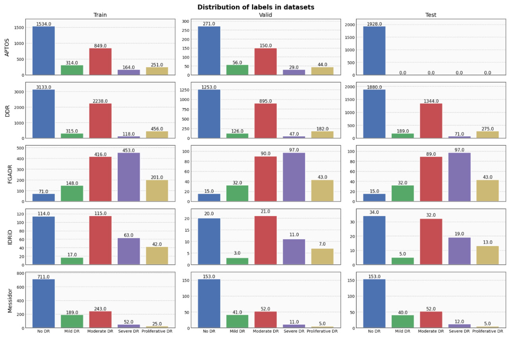
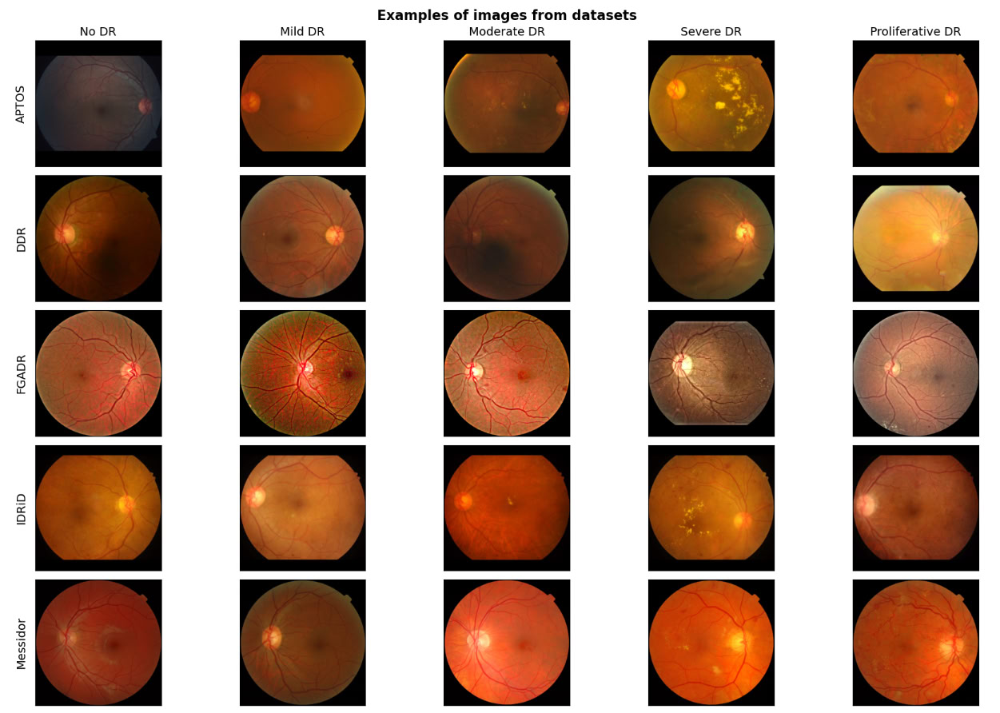

# Adversarial domain adoptation

## Problem statement

The biomedical imaging field is consistently confronted with several challenges, including limited data availability, class imbalance, and heightened sensitivity to model errors. Beyond these established difficulties, researchers and engineers face an additional critical challenge: enhancing model generalization capability for cases where patient data originates from multiple sources (e.g. equipment from different manufacturers, microscopes across different laboratories, etc.) that were not represented in training datasets.

In this work, we specifically address this challenge in solving Diabetic Retinopathy (DR) prediction task using ocular image data.

## Datasets overview

During our research we use 5 diffreent DR datasets : DDR [1], Messidor [2], IDRiD [3], APTOS [4], FGADR [5]. 

Each of them constains images of eyes, labeled on 5 classes. Label to diagnoses mapping looks as following : 

* 0 &mdash; No DR
* 1 &mdash; Mild DR
* 2 &mdash; Moderate DR
* 3 &mdash; Severe DR
* 4 &mdash; Proliferative DR

The following table illustrated the volume of each dataset, for convinince it is also partitioned by `Train`, `Validation` and `Test` splits. 

| Dataset   |   Train size |   Valid size |   Test size |   Total size |
|:----------|-------------:|-------------:|------------:|-------------:|
| **APTOS**     |         3112 |          550 |        1928 |         **5590** |
| **DDR**       |         6260 |         2503 |        3759 |        **12522** |
| **FGADR**     |         1289 |          277 |         276 |         **1842** |
| **IDRiD**    |          351 |           62 |         103 |          **516** |
| **Messidor**  |         1220 |          262 |         262 |         **1744** |

On this plots labels distribution are represented. 

It can be concluded, that 

* Datasets have strong class imbalance, classes 1, 3, 4 are not really frequent. 
* Inside a dataset splits of `Train`, `Validation` and `Test` have same labels distribution 
* Labels distribution across the datsets varies a lot

Also there are examples of samples from each dataset

## Proposed methodology

Our key contribution is based in the following observations : 

* If we can fit a domain-classfier on the top of predictive model enbeddings, it means, that this encoding contain information about domain-specific patters on images. 

* Based in this classifier's predictions we can try to enforce model to "forget" information about domain difference, yet still "remember" information about semantic of difference across DR classes. 

* This is very  similar to GAN pipeline, when a model trains to generate samples based on discriminative feedback. 

There were also fruitful prior works in field, but to our best knowledge , they were not adopted to biomedical field, nor developed deeper. 

So, our main pipeline may be described as followed : 

**[TODO till Friday : create an inage of pipline]** 

**[TODO till Friday : more formal description with losses, ect.]** 

## Experiments' setup description 

In this section our experimental setup ans expectations would be discussed. 

### Baseline 

As a simple and main baseline we treat a ViT model, pretrained on ImageNet and fully finetuned on the largest of out datasets &mdash; DDR. 

In our first experiment we evaluate this weights on the other datasets and with this we'd like to demonstrate the problem of domain shift. 

Next step of the research is to evalute a model, starting from this weights and finetuned in another dataset (we chose Messidor for the beginning). We expect, that after finetuning the model would preform significantly better only on Messidor, yet it would lose qulity on DDR. 

Finally, we would finetune the model after DDR pretrain via proposed method. With this experiment we're strived to demotrate better perfomance on all the datasets, not only on Messidor, without of loosing quality on DDR. 

In all the cases we train models till convergence of loss function. 

**TODO : add tensorboard screen**

### Dataset setup 

In our experiments we're strinved to be close to real-life setup, so we are following the next steps : 

* In first experiment we use only DDR with all labels. 

* In second experiment we use only 30 % of Messidor with lables for finetuning.

* In third experimnent we use 100 % without labels and 30 % of Messidor with labels and mixed it with DDR.

### Metrics 

As demostrated, datsets suffer from labels disbalance, thus using only accuracy metric is not greate idea in this case. So, we're evaluating across several ones : 

* Cohen's-kappa score 
* Confusion matrix 
* F1 with macro averaging 
* Accuracy 
* CE Loss 

## Experiments' results

In this section we report metrics from `Eval.ipynb` notebook. 

### Kappa-score 

DDR-pretrain only 

|    | Dataset   |   Train split |   Val split |   Test split |
|---:|:----------|--------------:|------------:|-------------:|
|  0 | APTOS     |         0.386 |       0.376 |        0     |
|  1 | DDR       |         0.548 |       0.696 |        0.467 |
|  2 | FGADR     |         0.074 |       0.083 |        0.024 |
|  3 | IDRiD     |         0.35  |       0.287 |        0.146 |
|  4 | Messidor  |         0.165 |       0.179 |        0.137 |

Messidor finetune 

|    | Dataset   |   Train split |   Val split |   Test split |
|---:|:----------|--------------:|------------:|-------------:|
|  0 | APTOS     |         0.335 |       0.294 |        0     |
|  1 | DDR       |         0.259 |       0.349 |        0.235 |
|  2 | FGADR     |         0.151 |       0.159 |        0.076 |
|  3 | IDRiD     |         0.355 |       0.254 |        0.234 |
|  4 | Messidor  |         0.562 |       0.421 |        0.358 |

Our approach 

|    | Dataset   |   Train split |   Val split |   Test split |
|---:|:----------|--------------:|------------:|-------------:|
|  0 | APTOS     |         0.443 |       0.429 |        0     |
|  1 | DDR       |         0.692 |       0.717 |        0.478 |
|  2 | FGADR     |         0.187 |       0.211 |        0.157 |
|  3 | IDRiD     |         0.387 |       0.397 |        0.16  |
|  4 | Messidor  |         0.344 |       0.296 |        0.313 |

### F1-macro 

DDR-pretrain only 

|    | Dataset   |   Train split |   Val split |   Test split |
|---:|:----------|--------------:|------------:|-------------:|
|  0 | APTOS     |         0.325 |       0.319 |        0.043 |
|  1 | DDR       |         0.462 |       0.484 |        0.398 |
|  2 | FGADR     |         0.196 |       0.209 |        0.148 |
|  3 | IDRiD     |         0.351 |       0.337 |        0.252 |
|  4 | Messidor  |         0.217 |       0.203 |        0.194 |

Messidor finetune 

|    | Dataset   |   Train split |   Val split |   Test split |
|---:|:----------|--------------:|------------:|-------------:|
|  0 | APTOS     |         0.373 |       0.347 |        0.094 |
|  1 | DDR       |         0.335 |       0.36  |        0.327 |
|  2 | FGADR     |         0.292 |       0.326 |        0.26  |
|  3 | IDRiD     |         0.371 |       0.312 |        0.326 |
|  4 | Messidor  |         0.667 |       0.395 |        0.358 |

Our approach 

|    | Dataset   |   Train split |   Val split |   Test split |
|---:|:----------|--------------:|------------:|-------------:|
|  0 | APTOS     |         0.41  |       0.387 |        0.05  |
|  1 | DDR       |         0.633 |       0.581 |        0.486 |
|  2 | FGADR     |         0.287 |       0.302 |        0.263 |
|  3 | IDRiD     |         0.455 |       0.454 |        0.327 |
|  4 | Messidor  |         0.41  |       0.332 |        0.421 |

### Accuracy 

DDR-pretrain only 

|    | Dataset   |   Train split |   Val split |   Test split |
|---:|:----------|--------------:|------------:|-------------:|
|  0 | APTOS     |         0.593 |       0.587 |        0.117 |
|  1 | DDR       |         0.735 |       0.821 |        0.702 |
|  2 | FGADR     |         0.305 |       0.332 |        0.251 |
|  3 | IDRiD     |         0.555 |       0.516 |        0.393 |
|  4 | Messidor  |         0.457 |       0.496 |        0.45  |

Messidor finetune 

|    | Dataset   |   Train split |   Val split |   Test split |
|---:|:----------|--------------:|------------:|-------------:|
|  0 | APTOS     |         0.562 |       0.538 |        0.312 |
|  1 | DDR       |         0.572 |       0.608 |        0.564 |
|  2 | FGADR     |         0.386 |       0.37  |        0.329 |
|  3 | IDRiD     |         0.542 |       0.468 |        0.457 |
|  4 | Messidor  |         0.738 |       0.68  |        0.679 |

Our approach 

|    | Dataset   |   Train split |   Val split |   Test split |
|---:|:----------|--------------:|------------:|-------------:|
|  0 | APTOS     |         0.63  |       0.626 |        0.145 |
|  1 | DDR       |         0.818 |       0.828 |        0.704 |
|  2 | FGADR     |         0.392 |       0.43  |        0.366 |
|  3 | IDRiD     |         0.571 |       0.581 |        0.393 |
|  4 | Messidor  |         0.625 |       0.626 |        0.651 |

### Cross Entropy Loss

DDR-pretrain only 

|    | Dataset   |   Train split |   Val split |   Test split |
|---:|:----------|--------------:|------------:|-------------:|
|  0 | APTOS     |         1.095 |       1.09  |        3.52  |
|  1 | DDR       |         0.71  |       0.615 |        0.812 |
|  2 | FGADR     |         1.636 |       1.581 |        1.704 |
|  3 | IDRiD     |         1.093 |       1.083 |        1.505 |
|  4 | Messidor  |         1.203 |       1.188 |        1.152 |

Messidor finetune 

|    | Dataset   |   Train split |   Val split |   Test split |
|---:|:----------|--------------:|------------:|-------------:|
|  0 | APTOS     |         1.849 |       1.857 |        3.711 |
|  1 | DDR       |         1.854 |       1.683 |        2.067 |
|  2 | FGADR     |         2.836 |       2.815 |        3.069 |
|  3 | IDRiD     |         1.996 |       2.022 |        2.408 |
|  4 | Messidor  |         1.298 |       1.724 |        1.739 |

Our approach 

|    | Dataset   |   Train split |   Val split |   Test split |
|---:|:----------|--------------:|------------:|-------------:|
|  0 | APTOS     |         1.207 |       1.189 |        4.924 |
|  1 | DDR       |         0.549 |       0.569 |        0.855 |
|  2 | FGADR     |         1.559 |       1.516 |        1.67  |
|  3 | IDRiD     |         1.054 |       1.101 |        1.653 |
|  4 | Messidor  |         0.964 |       1.054 |        0.93  |

## Conclusions

* As expected, simple finetune till convergence on a dataset, which is smaller than the one used for thrining base model leads to model degradtion on other datasets and ruines generalization 

* In the process of experiments we realized, that discriminator decoder architecture affects the results. The more complex discriminator we use, less domain information do we reduce from bachbone representation. 

* Adversarial finetuning method showed promissing results in this fields and requres more research and exploration to be used in real-life scenarios 

* Method id powerful due to its flexibility to different data setups and requriments of samll amount of labeled data from new domain 

## Reproducing the results

**TODO : add instructions + drive with weights**

## Further directions

* Testing in setups with multiple new domains. 

* Combining with other unsepervised methods.

* Adding medical-specific architectual and data pre-or post-processing procedures. 

## References

[1] 

[2]

[3]

[4]

[5]

[6]

[7]